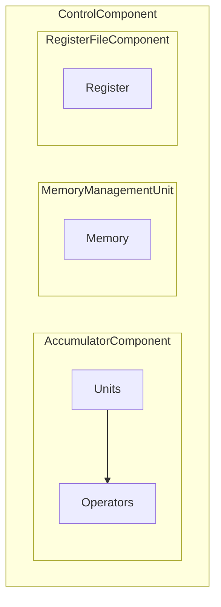

# Concept

## Commands
### ALU
Keyword: ALU
* SET [OP1|OP2|TARGET|OP] [value]
* SHOW [OP1|OP2|TARGET|OP]
* PROCESS

### RegisterFile
Keyword: REG
* SET [address] [value]
* SET [address] PRESENT [value]
* GET [address]
* SHOW [address]

### MemoryManagementUnit
Keyword: MMU
* GET [address]
* SET [address] [value]

## Klassen
### RegisterFile
* Hat mehrere Register, feste Anzahl ab Initialisierung
  * Jedes Register kann ein Byte Daten speichern, Typ byte
  * Kann gelesen und geschrieben werden
  * Jedes Register hat ein P-Bit, welches angibt ob das Register belegt ist mit einem Wert

### Accumulator
* Kann eine Operation ausführen mit drei Adressen
* Hat mehrere Units, die unterschiedliche Operationen durchführen können
  * ArithmeticUnit: ADD, SUBTRACT, MULTIPLY, DIVIDE
  * ComparisonUnit: EQUAL, GREATER, LESS
  * LogicalUnit: AND, OR, NOR, XOR
  * ShifterUnit: LEFT_SHIFT, RIGHT_SHIFT
* Die zuständige Unit wird mittels 

### Units
* Eine Unit ist für eine Operation zuständig und nimmt

## Klassenstruktur
